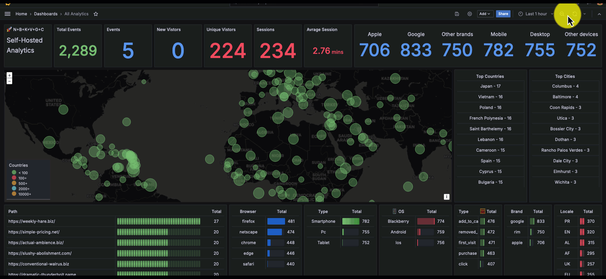

# N+B+K+V+G+C = Self-Hosted Analytics


Create a self-hosted Analytics solution using

- **N** - [Nginx](https://ngnix.org) as revers-proxy and rate-limiter.
- **B** - [Benthos](https://www.benthos.dev/) as input stream-pipeline.
- **K** - [Kafka](https://kafka.apache.org/) as message-store and queue manager.
- **V** - [Vector](https://vector.dev/) as data aggregator.
- **G** - [Grafana](https://grafana.com/) as a rich dashbaord
- **C** - [ClickHouse](https://clickhouse.com/) as a real-time OLAP database.
-

> Check the lab [Article](https://blog.binyamin.dev/self-hosted-analytics)

### Folder structure

- `docker` - contains all deployment files for `docker-compose` environments
- `terraform` - easy deploy to [Hetnzer](https://hetzner.cloud/?ref=fyc6kzw73uI5) with domains in CloudFlare.

> This project uses [justfile](./justfile) for project commands management. Check [here](https://just.systems/man/en/chapter_4.html) for installation instructions.

### Manual deploy

For manual deploy check the instructions in the [article](https://blog.binyamin.dev/self-hosted-analytics).

### Terraform deploy

`cd` into the [terraform](./terraform) folder and rename `terraform.tfvars.example` to `terraform.tfvars`

```shell
cd terraform
mv terraform.tfvars.example terraform.tfvars
```

Set your variables inside the `terraform.tfvars` file:

| Variable             | For?                                                                                            | Default value       |
|----------------------|-------------------------------------------------------------------------------------------------|---------------------|
| cloudflare_token     | Cloudflare token with access to zone management                                                 | "YOUR_TOKEN"        |
| cloudflare_zone_name | Cloudflare zone name. Usually the domain name                                                   | "YOUR_ZONE_NAME"    |
| hetzner_token        | Hetzner project token                                                                           | "YOUR_TOKEN"        |
| ssh_key              | Your SSH key name in Hetnzer project                                                            | "YOUR_SSH_KEY_NAME" |
| zone                 | Hetnzer server [zone](https://docs.hetzner.com/cloud/general/locations/)                        | "ash"               |
| server_size          | Hetzner service https://www.hetzner.com/cloud/. (Make sure it's available in the selected zone) | "cpx21"             |

After you've set the variables, run:

```shell
terraform init
terraform apply
```

Check the deployment and prompt `yes` in case you're satisfied with the details.

In the end, you'll see output like this:

```
domain = <<EOT
Access dashbaord at dashboard.domain.com
Send analytics to analytics.domain.com
EOT
```